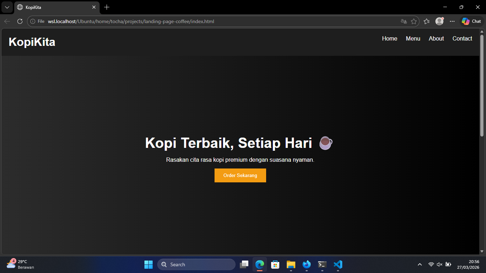

# ☕ Coffee Landing Page

Modern and responsive coffee shop landing page built using HTML & CSS.
This project is designed as a simple business website for showcasing products and services.

---

## 🚀 Features

* Responsive design (mobile friendly)
* Clean and modern UI
* Sticky navigation bar
* Smooth hover effects
* Simple and elegant layout

---

## 🖼️ Preview



---

## 🌐 Live Demo

https://mufti-code.github.io/landing-page-coffee

---

## 🛠️ Tech Stack

* HTML5
* CSS3

---

## 📦 Installation

Clone this repository:

```bash
git clone https://github.com/Mufti-code/landing-page-coffee.git
```

Open the project:

```bash
cd landing-page-coffee
```

Run in browser:

* Open `index.html`

---

## 📁 Project Structure

```
landing-page-coffee/
│── index.html
│── style.css
│── preview.png
```

---

## 💡 About

This project was created as part of a learning journey in web development and to build a portfolio for freelance opportunities.

---

## 📬 Contact

If you are interested in working together, feel free to reach out.
